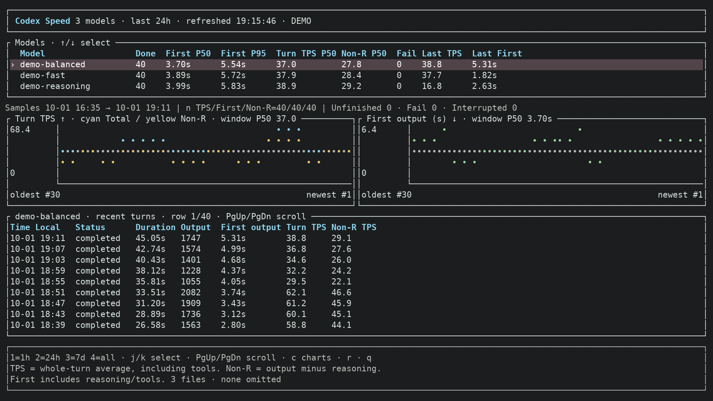

# Codex Speed

**English** | [简体中文](README.zh-CN.md)

A local terminal dashboard for Codex CLI throughput and first-output latency, grouped by model.
Reads existing logs without changing your provider or proxying requests.



Dashboard preview with synthetic demo data.

## Quick start

Requires Rust 1.88+.

```sh
cargo run --release
```

Or install the binary:

```sh
cargo install --path . --locked
codex-speed
```

Use release builds for faster startup. The first launch scans selected logs; subsequent updates read only appended data. State stays in memory and is rebuilt on restart.

## Options

| Option | Purpose | Default |
| --- | --- | --- |
| `--codex-home PATH` | Codex log directory | `$CODEX_HOME` or `~/.codex` |
| `--limit N` | Load the N most recently modified supported files; `0` removes the file limit | `50` |
| `--hours N` | Statistics from the last N hours; `0` includes all loaded history | `24` |
| `--json` | Print one JSON snapshot | Off |
| `--demo` | Preview with synthetic data | Off |

Each file retains its latest **100 turns**. `PARTIAL` indicates omitted files/turns or read/parse errors. “Loaded history” includes only retained records; changing the time window does not load more files.

## Controls

| Key | Action |
| --- | --- |
| `↑/↓`, `j/k` | Select model |
| `1 / 2 / 3 / 4` | 1 hour / 24 hours / 7 days / loaded history |
| `PgUp/PgDn`, `Home` | Scroll turns / return to latest |
| `c` | Toggle charts |
| `r` | Refresh |
| `q`, `Esc`, `Ctrl+C` | Quit |

Turn lists show newest first. Charts show the latest 30 completed turns **oldest → newest**; spacing represents turn order, not elapsed time. Gray reference lines show the selected window’s P50. Charts appear at 100 columns × 36 rows or larger. Displayed times use the local timezone; JSON uses UTC.

## Metrics

| Metric | Meaning |
| --- | --- |
| First P50 / P95 | Median / 95th percentile of persisted first-output latency; may include reasoning or tool output |
| Turn TPS P50 | Median of each turn’s total output tokens ÷ whole-turn duration |
| Non-R P50 | Median of each turn’s non-reasoning output tokens ÷ whole-turn duration |
| Last TPS / First | Latest successfully completed turn’s measurements |
| Input / Cached | Per-turn input tokens / cached input tokens; selected-model details show totals and valid sample counts for successful turns in the window |

Token counts use decimal units in the UI: `K` = thousand, `M` = million, `B` = billion (e.g. `1.19M`). Display values are rounded; JSON retains exact integers.

`input_tokens` includes `cached_input_tokens`; do not add them together. Counts use the turn usage snapshot when available, or differences of cumulative session usage for legacy logs. Missing fields remain `—`, not zero. Input counts are not used to estimate prefill speed.

**TPS includes tool execution and waiting; it is not streaming generation speed.** Non-reasoning output can include tool arguments. Task complexity and reasoning settings affect comparisons.

Only completed turns contribute to metrics. Missing measurements show `—` (`null` in JSON); each metric has its own sample count. P95 uses nearest rank and is less informative with small samples. “Unfinished” means no end event was recorded, not necessarily an active process.

## Supported logs

Reads uncompressed JSONL in `sessions/` and `archived_sessions/`, with sources `cli`, `exec`, or `vscode`. Watches changes with a two-second polling fallback. Availability of timing metrics depends on the Codex log version.

Compressed archives, cross-file history stitching, subagent aggregation, and implicit server-side model routing are not supported.

## Development

Built with Rust, Ratatui/Crossterm, Clap, Notify/Walkdir, Serde, and Chrono. Dependencies are pinned in `Cargo.lock`.

```sh
cargo fmt --check
cargo test --locked
cargo clippy --all-targets --locked -- -D warnings
```
