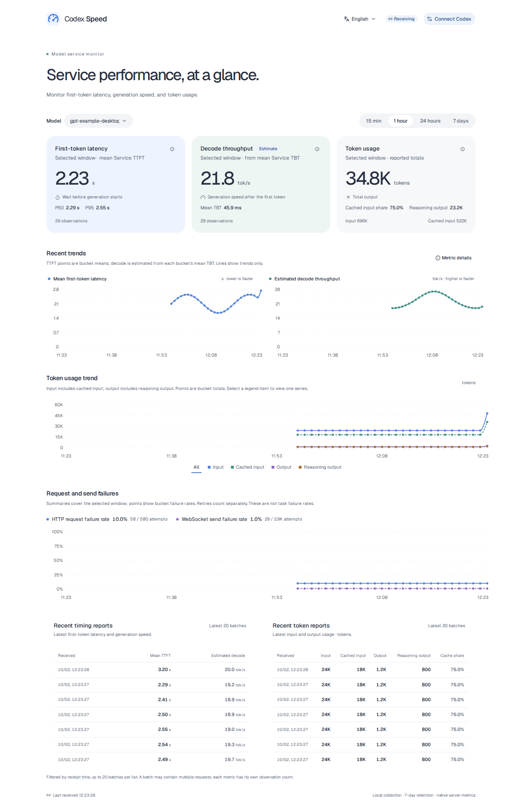

# Codex Speed

**English** | [简体中文](README.zh-CN.md)

A local web dashboard for Codex model service performance: first-token latency, estimated decode throughput, token usage, and request failures. Uses Codex's native OpenTelemetry metrics.



*Preview uses sample data.*

Switch between English and Simplified Chinese in the top-right corner. The dashboard follows your browser language on first visit and remembers your choice.

## Get started

Building requires Rust 1.94+, Node.js 24+, and pnpm 12.8.1. Run from the repository root:

```sh
pnpm install --frozen-lockfile
pnpm build
./target/release/codex-speed
```

Open <http://127.0.0.1:4318>. The executable includes the frontend; Node.js is only needed for building.

## Connect Codex

Keep the dashboard running, then start Codex in another terminal:

```sh
OTEL_METRIC_EXPORT_INTERVAL=1000 codex --enable runtime_metrics \
  -c 'otel.metrics_exporter={otlp-http={endpoint="http://127.0.0.1:4318/v1/metrics",protocol="json"}}'
```

This exports metrics about every second. Settings apply to this launch only; restart an existing Codex process to use them.

To keep the exporter enabled, merge these settings into the existing tables in `~/.codex/config.toml`:

```toml
[features]
runtime_metrics = true

[otel]
metrics_exporter = { otlp-http = { endpoint = "http://127.0.0.1:4318/v1/metrics", protocol = "json" } }
```

Set `OTEL_METRIC_EXPORT_INTERVAL=1000` in your shell for one-second exports. `runtime_metrics` is experimental; timing availability depends on your Codex version and provider. See the [Codex configuration reference](https://learn.chatgpt.com/docs/config-file/config-reference).

## Read the metrics

Select a model and a time window. Values summarize that window; they are not instantaneous readings.

| Metric | Meaning |
| --- | --- |
| First-token latency | Mean server-reported Service TTFT; lower is faster |
| Estimated decode throughput | `1000 ÷ mean Service TBT (ms)`; higher is faster |
| TTFT P50 / P95 | Median and 95th percentile; histogram estimates are marked `≈`. P95 requires 20 observations |
| Token usage | Reported totals for input, cached input, output, and reasoning output |
| Cached input share | Cached input ÷ input; not a request cache hit rate |
| HTTP request failure rate | Failed HTTP attempts ÷ all HTTP attempts |
| WebSocket send failure rate | Failed request-frame sends ÷ all sends |

Input includes cached input; output includes reasoning output. Do not add these subsets to their totals. Reasoning tokens measure internal reasoning, not visible answer length. Missing values appear as `—`, not zero.

Timings come from the server and exclude client network latency and local tool execution. Decode throughput is an estimate from Service TBT, not a per-token measurement. Timing and token reports have separate sample counts; token usage usually arrives after a turn ends.

Trend points show time-bucket averages for timings and totals for tokens. Lines connect observations without filling missing values. Select a token legend item to view one series. Additional server timings are available under **Metric details**.

The recent lists show one received export batch per model per row, up to 20 batches in the selected receipt-time window. TTFT is the batch mean, decode is estimated from batch mean TBT, and token values are batch totals. Each metric has its own observation count. A batch can contain multiple requests; missing fields remain unknown.

Failure rates count retries separately. WebSocket send success does not mean generation succeeded; neither failure rate measures task success or captures every subsequent streaming error.

## Storage and access

History is kept locally for seven days and survives restarts. On Linux, the default database is `~/.local/share/codex-speed/metrics.sqlite`. Prompts are not stored. If the database cannot be loaded at startup, it is deleted and recreated empty.

| Option | Default |
| --- | --- |
| `--host IP` | `0.0.0.0` |
| `--port PORT` | `4318` |
| `--data-dir PATH` | System local data directory / `codex-speed` |

Other computers can access `http://<server IP>:4318`; remote Codex exporters should use that server IP too. Use `--host 127.0.0.1` for local-only access. There is no login authentication. If you change the port, update the Codex exporter endpoint.

## Development

```sh
cargo install watchexec-cli --locked
pnpm install --frozen-lockfile
pnpm dev
```

Open <http://127.0.0.1:5173>. Frontend changes update immediately; Rust changes trigger a rebuild and restart. Ctrl+C stops both servers.

Codex still exports to `http://127.0.0.1:4318/v1/metrics`. Development data is separate at `target/dev-data/metrics.sqlite`. Development and release use the same backend port, so run one at a time. For an executable with the frontend embedded, use the build commands above.

```sh
pnpm lint
pnpm typecheck
pnpm browsers
pnpm test
```

Tests cover metric collection, filters, language switching, desktop layouts, and accessibility. Playwright regenerates English and Chinese preview images in `docs/assets/`.
