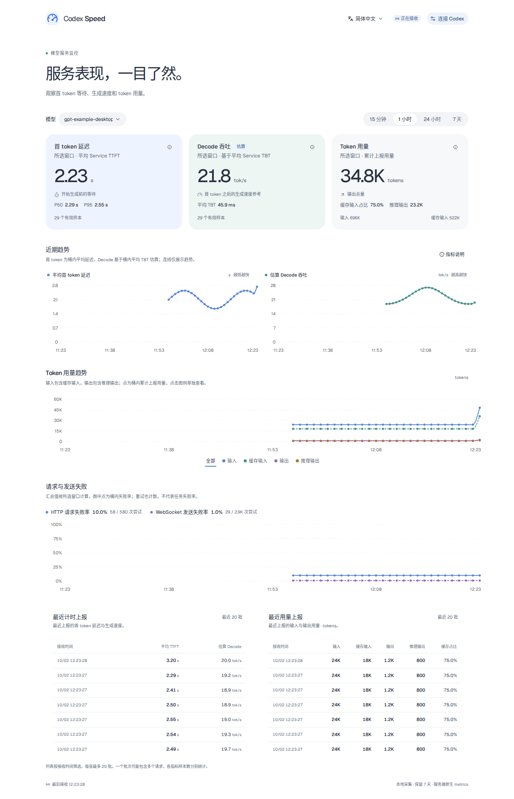

# Codex Speed

[English](README.md) | **简体中文**

监控 Codex 模型服务表现的本地网页工具：首 token 延迟、估算 Decode 吞吐、token 用量及请求失败率。数据来自 Codex 原生 OpenTelemetry metrics。



*截图使用示例数据。*

右上角可切换简体中文和英文。首次访问按浏览器语言选择，之后记住你的选择。

## 开始使用

构建需要 Rust 1.94+、Node.js 24+ 和 pnpm 12.8.1。在项目根目录执行：

```sh
pnpm install --frozen-lockfile
pnpm build
./target/release/codex-speed
```

打开 <http://127.0.0.1:4318>。网页已嵌入可执行文件，运行时不需要 Node.js。

## 连接 Codex

保持监控运行，在另一个终端启动 Codex：

```sh
OTEL_METRIC_EXPORT_INTERVAL=1000 codex --enable runtime_metrics \
  -c 'otel.metrics_exporter={otlp-http={endpoint="http://127.0.0.1:4318/v1/metrics",protocol="json"}}'
```

该命令每隔约一秒导出指标。设置只对这次启动生效；已运行的 Codex 需要重新启动。

若希望永久启用导出，将以下设置合并进 `~/.codex/config.toml` 的现有表：

```toml
[features]
runtime_metrics = true

[otel]
metrics_exporter = { otlp-http = { endpoint = "http://127.0.0.1:4318/v1/metrics", protocol = "json" } }
```

在 shell 中设置 `OTEL_METRIC_EXPORT_INTERVAL=1000`，即可按一秒间隔导出。`runtime_metrics` 是实验性功能，计时数据是否可用取决于 Codex 版本和提供方。参见 [Codex 配置文档](https://learn.chatgpt.com/docs/config-file/config-reference)。

## 如何看指标

选择模型和时间范围后，页面显示该窗口内的统计值，而非瞬时读数。

| 指标 | 含义 |
| --- | --- |
| 首 token 延迟 | 服务端报告的 Service TTFT 平均值，越低越快 |
| 估算 Decode 吞吐 | `1000 ÷ 平均 Service TBT (ms)`，越高越快 |
| TTFT P50 / P95 | 中位数和第 95 百分位数；直方图估算值标记为 `≈`，P95 至少需要 20 个观测 |
| Token 用量 | 输入、缓存输入、输出、推理输出的报告总量 |
| 缓存输入占比 | 缓存输入 ÷ 输入，不是请求缓存命中率 |
| HTTP 请求失败率 | 失败请求尝试数 ÷ 全部请求尝试数 |
| WebSocket 发送失败率 | 请求帧发送失败数 ÷ 全部发送数 |

输入包含缓存输入，输出包含推理输出，不能重复相加。推理输出是内部推理用量，不是可见回答长度。缺失值显示 `—`，不当作零。

计时来自服务端，不包含客户端网络延迟和本地工具执行时间。Decode 吞吐由 Service TBT 估算，并非逐 token 实测。计时与用量分别统计样本数，token 用量通常在一轮结束后上报。

趋势图按时间分桶：计时展示平均值，用量展示合计值。连线连接已有观测，不填补缺失数据。点击 token 图例可单独查看一类用量。其他服务端计时可在**指标说明**中查看。

最近上报列表每行展示一次推送批次中所选模型的数据，按接收时间筛选，最多显示 20 批。TTFT 为批次平均值，Decode 根据批次平均 TBT 估算，用量为批次合计，各指标保留自己的样本数。一批可能包含多个请求，缺失字段保持未知。

失败率将重试单独计数。WebSocket 发送成功不代表生成成功；两种失败率均不代表任务成功率，也不涵盖后续所有流式错误。

## 数据与访问

本地保留最近七天的数据，重启后历史仍在。Linux 默认数据库为 `~/.local/share/codex-speed/metrics.sqlite`，不保存提示词。启动时若数据库无法加载，会删除并重建空库。

| 参数 | 默认值 |
| --- | --- |
| `--host IP` | `0.0.0.0` |
| `--port PORT` | `4318` |
| `--data-dir PATH` | 系统本地数据目录 / `codex-speed` |

其他电脑可通过 `http://<服务器 IP>:4318` 访问，远程 Codex 的导出地址也应使用服务器 IP。仅需本机访问时，使用 `--host 127.0.0.1`。服务没有登录认证。修改端口后，请同步修改 Codex 的导出地址。

## 开发

```sh
cargo install watchexec-cli --locked
pnpm install --frozen-lockfile
pnpm dev
```

打开 <http://127.0.0.1:5173>。前端修改即时更新，Rust 修改自动重新编译并重启，Ctrl+C 同时停止两个服务。

Codex 仍向 `http://127.0.0.1:4318/v1/metrics` 上报。开发数据独立保存在 `target/dev-data/metrics.sqlite`。开发与发布环境共用后端端口，请勿同时启动。需要内嵌网页的可执行文件时，使用上面的构建命令。

```sh
pnpm lint
pnpm typecheck
pnpm browsers
pnpm test
```

测试覆盖指标采集、筛选、语言切换、桌面布局及可访问性。Playwright 会在 `docs/assets/` 中重新生成中英文预览截图。
